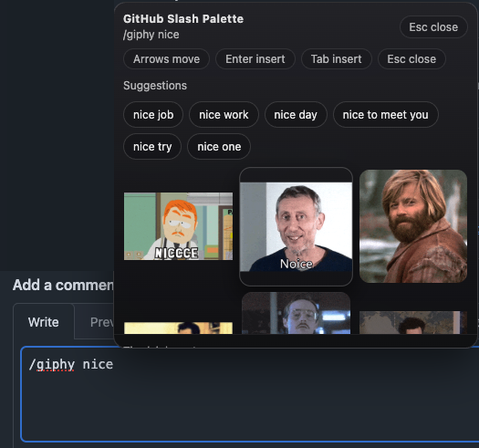

  <a href="https://chromewebstore.google.com/detail/kkcajoojbaidfdnjecjnbeaheepknkpf"></a> <a href="https://chromewebstore.google.com/detail/kkcajoojbaidfdnjecjnbeaheepknkpf"></a>

# GitHub Slash Palette

Slash commands for GitHub markdown fields. Includes GIF search, emoji picker, Mermaid diagrams, and more.

## Latest Release In Chrome Web Store

[GitHub Slash Palette](https://chromewebstore.google.com/detail/kkcajoojbaidfdnjecjnbeaheepknkpf?utm_source=item-share-cb)

## Live Demo

Try the extension without installing it. All deployments (main + PR previews): **[Deployments Index](https://da-ba.github.io/gsp/)**

---

## Features

- Adds slash command palette to GitHub markdown textareas
- Type `//` to see all available commands
- `//giphy` to search and insert GIFs
- `//emoji` to search and insert emojis
- `//font` to style text with sizes, colors, and formatting
- `//kbd` to format keyboard shortcuts
- `//link` to insert markdown links with auto-generated titles
- `//link ci` to link to CI jobs and artifacts (requires GitHub token)
- `//mention` for context-aware participant mentions
- `//mermaid` to insert diagram templates
- `//now` to insert formatted timestamps
- Uses `//` prefix to avoid conflicts with GitHub's native `/` commands
- Easily extensible with new commands

---

## Available Commands

See [docs/commands/README.md](docs/commands/README.md) for a full list and usage details.

---

## Screenshots



---

## Getting Started

### Prerequisites

- [Bun](https://bun.sh/) (v1.0+)

### Setup

```bash
bun install
bun run build
```

### Local Installation

1. Build: `bun install && bun run build`
2. Open `chrome://extensions`
3. Enable Developer mode
4. Click **Load unpacked**
5. Select the `dist` folder

---

## Usage

1. Go to GitHub
2. Open an issue or PR comment field
3. Type `//giphy cats` (or just `//` for command list)
4. Use arrow keys to navigate
5. Press Enter to insert
6. Press Esc to close

> **Note:** We use `//` (double slash) to avoid conflicts with GitHub's native `/` commands like `/code`, `/table`, etc.

---

## Development

### Watch Mode

For development with automatic rebuilding:

```bash
bun run dev
```

This starts Bun in watch mode. Reload the extension in Chrome to see changes.

### Bundle Analysis

To check bundle sizes:

```bash
bun run analyze
```

This reports the size of each bundle after building.

### End-to-End Tests

Run Playwright E2E tests:

```bash
bun run test:e2e
```

---

## Project Structure

```
src/
├── assets/             # Static assets (icons, images)
├── content/            # Content scripts
│   ├── commands/       # Slash command implementations
│   │   ├── <command>/  # Each command in its own folder
│   │   │   ├── api.ts       # Data layer (API calls, storage)
│   │   │   ├── api.test.ts  # API tests
│   │   │   ├── command.ts   # CommandSpec implementation
│   │   │   ├── command.test.ts
│   │   │   └── index.ts     # Barrel exports
│   │   ├── grid-handlers.ts # Shared grid rendering handlers
│   │   ├── registry.ts      # Command registry
│   │   └── index.ts         # Command exports
│   ├── picker/         # Picker UI (React components)
│   │   ├── components/ # React UI components
│   │   ├── state.ts    # Global picker state
│   │   └── styles.ts   # Shared styles
│   ├── index.ts        # Content entry
│   └── types.ts        # Shared types
├── options/            # Options page
│   ├── components/     # React options components
│   └── github/         # GitHub API options
├── utils/              # Shared utilities
│   ├── dom.ts          # DOM manipulation
│   ├── filter-sort.ts  # Generic filtering/sorting
│   ├── math.ts         # Math utilities
│   ├── storage.ts      # Chrome storage wrapper
│   ├── svg.ts          # SVG utilities
│   ├── theme.ts        # Theme detection
│   └── tile-builder.ts # SVG tile generation
dist/                   # Build output (load in Chrome)
docs/commands/          # Per-command documentation
e2e/                    # End-to-end tests (Playwright)
scripts/                # Build scripts
```

---

## Scripts

| Script                | Description                        |
|-----------------------|------------------------------------|
| `bun run build`       | Production build to `dist/`        |
| `bun run dev`         | Watch mode for development         |
| `bun run typecheck`   | TypeScript type checking           |
| `bun run lint`        | ESLint check                       |
| `bun run lint:fix`    | ESLint auto-fix                    |
| `bun run format`      | Format with Prettier               |
| `bun run format:check`| Check Prettier formatting          |
| `bun run test`        | Run unit tests (Vitest)            |
| `bun run test:e2e`    | Run E2E tests (Playwright)         |
| `bun run analyze`     | Build and report bundle sizes      |
| `bun run check`       | Run all checks (type, lint, format, test) |
| `bun run clean`       | Remove `dist/` folder              |

---

## Adding New Commands

1. Create a new folder `src/content/commands/<command>/` with:
   - `api.ts` - Data layer (API calls, storage)
   - `command.ts` - CommandSpec implementation
   - `index.ts` - Barrel exports
2. Export the command from `src/content/commands/index.ts`.
3. Add end-user docs under `docs/commands/<command>/README.md`.

Example skeleton:

```typescript
import { registerCommand, type CommandSpec } from "../registry.ts"
import { createGridHandlers } from "../grid-handlers.ts"
import { insertTextAtCursor } from "../../picker/index.ts"
import type { PickerItem } from "../../types.ts"

type MyItem = { id: string; label: string }

const myCommand: CommandSpec = {
  preflight: async () => ({ showSetup: false }),
  getEmptyState: async () => ({ items: [], suggest: [] }),
  getResults: async (query) => ({ items: [] }),
  ...createGridHandlers<MyItem>((item) => insertTextAtCursor(item.label)),
}

registerCommand("mycommand", myCommand)
```

---

## GitHub API Token Setup

Some features require a GitHub Personal Access Token (PAT):

- `//link ci` - Link to CI jobs and artifacts

### Option 1: In picker settings
1. Type `//link ci` or click the settings gear
2. Find **GitHub Token** section
3. Paste your token and click **Save**

### Option 2: In options page
1. Open `chrome://extensions`
2. Find GitHub Slash Palette → **Details**
3. Click **Extension options**
4. Find **GitHub API** section
5. Paste the token and Save

**Token requirements:**
- Create a [Personal Access Token](https://github.com/settings/tokens/new)
- For public repos: `public_repo` scope
- For private repos: `repo` scope

**Where is the token stored?**
> The token is stored using `chrome.storage.local` on your device only.

---

## Giphy API Key Setup

### Option 1: In picker
1. Type `//giphy`
2. Paste your key in the setup panel
3. Press **Test** to verify
4. Press **Save**

### Option 2: In options page
1. Open `chrome://extensions`
2. Find GitHub Slash Palette
3. Click **Details**
4. Click **Extension options**
5. Paste the key and Save

**Where is the key stored?**
> The key is stored using `chrome.storage.local` on your device only.

---

## Tech Stack

- **Build Tool**: [Bun](https://bun.sh/) - Fast all-in-one JavaScript runtime
- **UI Support**: React/JSX available for components
- **Testing**: [Vitest](https://vitest.dev/) (unit tests) + [Playwright](https://playwright.dev/) (E2E tests)
- **Language**: TypeScript with JSX support
- **Linting**: ESLint + Prettier

---

## Publishing to Chrome Web Store

A GitHub Actions workflow is available for publishing releases to the Chrome Web Store using [Google's official Chrome Web Store API](https://developer.chrome.com/docs/webstore/api).

### Usage

1. Go to **Actions** → **Publish to Chrome Web Store**
2. Click **Run workflow**
3. Enter the version to publish (e.g., `0.0.4`)
4. Click **Run workflow**

The workflow:
1. Downloads the release artifact from GitHub Releases
2. Authenticates with Google OAuth2
3. Uploads the extension using the official [Chrome Web Store API](https://developer.chrome.com/docs/webstore/api/reference/rest)
4. Publishes the extension for review

### Required Secrets

Configure these secrets in repository settings (**Settings** → **Secrets and variables** → **Actions**):

| Secret | Description |
|--------|-------------|
| `CHROME_EXTENSION_ID` | Extension ID from Chrome Web Store |
| `CHROME_CLIENT_ID` | OAuth 2.0 client ID |
| `CHROME_CLIENT_SECRET` | OAuth 2.0 client secret |
| `CHROME_REFRESH_TOKEN` | OAuth 2.0 refresh token |

### Obtaining Chrome Web Store API Credentials

1. Go to [Google Cloud Console](https://console.cloud.google.com/)
2. Create a project (or select existing)
3. Enable the **Chrome Web Store API**
4. Create OAuth 2.0 credentials (Web application type) with redirect URI `https://developers.google.com/oauthplayground`
5. Use the [OAuth Playground](https://developers.google.com/oauthplayground/) to obtain a refresh token with scope `https://www.googleapis.com/auth/chromewebstore`

For detailed instructions, see the [Chrome Web Store API documentation](https://developer.chrome.com/docs/webstore/using-api).

---

## Privacy

See [PRIVACY.md](PRIVACY.md) for the privacy policy.

## License

See [LICENSE](LICENSE).
