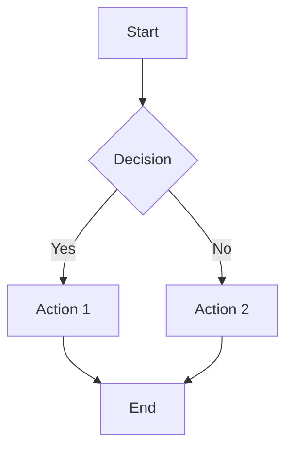

# /mermaid Command

Insert Mermaid diagram templates into GitHub markdown. GitHub natively renders Mermaid diagrams in markdown code blocks.

## Usage

1. In any GitHub comment/review textarea, type:
   - `/mermaid` to see all diagram templates
   - `/mermaid flow` to filter to flowchart templates
2. Navigate results:
   - Arrow keys to move selection
   - `Enter` or `Tab` to insert
   - `Esc` to close

## Available Diagram Types

### Flow Diagrams
- **Flowchart**: Basic flowchart with decision nodes
- **Flowchart LR**: Left-to-right flowchart

### Sequence Diagrams
- **Sequence**: Actor interactions with messages

### Class Diagrams
- **Class**: UML-style class relationships

### State Diagrams
- **State**: State machine diagram

### Other
- **Pie Chart**: Simple pie chart
- **Gantt**: Project timeline chart
- **ER Diagram**: Entity-relationship diagram

## Examples

| Input | Description |
|-------|-------------|
| `/mermaid` | Show all diagram templates |
| `/mermaid flow` | Filter to flowchart templates |
| `/mermaid sequence` | Filter to sequence diagrams |
| `/mermaid class` | Filter to class diagrams |

## What gets inserted

A Mermaid code block is inserted:

~~~markdown

~~~

## Notes

- Templates are starting points that you can customize
- GitHub automatically renders Mermaid diagrams in issues, PRs, and markdown files
- See [Mermaid documentation](https://mermaid.js.org/) for full syntax reference

## Developer notes

Implementation files:

- Command: `src/content/commands/mermaid/command.ts`
- Diagram templates: `src/content/commands/mermaid/api.ts`
